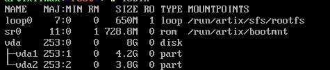

# roger-skyline-1

Our task with roger-skyline is to install a VM with the Linux OS of our choice. We have to have a VM disk size of 8GB, one partition has to be 4.2GB, and we also need to setup some networking and security for our VM.

The second part of roger-skyline is to install a web server on the VM.

## How to install Artix Linux with roger-skyline-1 project requirements

### Virtualization Stack

My preferred virtualization stack is QEMU+Virt-Manager. The reason people prefer QEMU over VirtualBox is its performance. Virt-Manager is a front-end for QEMU because QEMU by itself is a terminal application.

I chose QEMU because I wanted to learn a new tech stack.

How to install QEMU+Virt-Manager: https://youtu.be/wxxP39cNJOs

### Install

Downloade the ISO file from here: https://artixlinux.org/download.php

Just select the base verison of runit and then run the ISO on your hypervisor.

When setting up the VM remember to make the disk image size 8GB.

Login with `root` as username and `artix` as password.

#### Partitioning

Use the `cfdisk` program to manage and display a disk partition table.

Open `cfdisk /dev/vda` 

*For me it's vda but for some it might be /dev/sda or if you're not doing this to a VM it might be something beginning with nvme.*

  1. Select gpt as label type.

*We need to have two partitions. The root partition and the home partition. If you have a UEFI system (not a VM)  you need the boot partition, and if you are limited in memory, you probably want swap space. The swap space is for when you have limited memory and the operating system can use your hard drive as RAM.*

  2. Select free space and make a new partition of 4.2G. Then a second one with 3.8G. The bigger one is for the home.

  3. Write the changes and quit the program.



If you use `lsblk` it shoud look something like that above.

#### Creating file systems

We will create a ext4 file system with the `mkfs` program.

Make sure to make the home partition the bigger one.

  1. `mkfs.ext4 -L HOME /dev/vda1`

  2. `mkfs.ext4 -L ROOT /dev/vda2`

We are labeling them so mounting is easier.

#### Mounting

After creating the file systems we need to mount the partition so we can chroot to them.

  1. `mount /dev/disk/by-label/ROOT /mnt`

  2. `mkdir /mnt/home`

  3. `mount /dev/disk/by-label/HOME /mnt/home`

#### The Actual Install

Run the following:

  1. `basestrap /mnt base base-devel runit elogind-runit linux vim` <-- Install the base system and kernel

Base-devel is optional but needed for sudo, vim and pacman. Everything else is mandatory.

  2. `fstabgen -U /mnt >> /mnt/etc/fstab` <-- For defining how disk partitions are mounted

#### Configure The System

Now we have to chroot to get inside the system.

  1. Run `artix-chroot /mnt`

After this step we are going to be inside our system.

Here you can change to using bash by just typing `bash`.

#### Systemclock

  1. Setup systemclock with `ln -sf /usr/share/zoneinfo/Region/City /etc/localtime`,

  2. and `hwclock --systohc`

#### Localization

Edit and uncomment your locales you want.

  1. `vim /etc/locale.gen`

  2. Then generare locale using `locale-gen`

#### Boot Loader
This is perhaps the most important step. We are going to use grub for our boot loader.

  1. `pacman -S grub os-prober efibootmgr` <-- Install grub

  2. `grub-install --recheck /dev/vda` <-- Add `--force` if it's complaining about blacklists

  3. `grub-mkconfig -o /boot/grub/grub.cfg`

#### Adding Users

  1. First set root password with: `passwd`.

  2. Second create a regular user with:

```
useradd -m user
passwd user
```

Then we need to add our new user to the sudoers.

Add it first to the wheel group. It's like a sudo group.

  3. `usermod -aG wheel user`

  4. Open the sudoers file in `etc/sudoers` and uncomment this line: `# %wheel ALL=(ALL) ALL`.

Use `:w !sudo tee %` for writing read only files in vim.

To test if it works:
```
su user

whoami
> user

sudo whoami
> root
```

#### Network config

First we need to install NetworkManager to handle our connection.

`pacman -Sy networkmanager networkmanager-runit network-manager-applet`

Later we will link the NetworkManager service.

Then we setup a hostname to identify the machine on a network.

`vim /etc/hostname`

And then edit your `/etc/hosts` file like this:
```
127.0.0.1   localhost
::1         localhost
127.0.0.1   hostname.localdomain hostname
```

Setup is done! Now exit and reboot by:

```
exit <--exiting the chroot
umount -R /mnt
poweroff
```
### Your First Login

When you first login add NetworkManager to the list of services:

`sudo ln -s  /etc/runit/sv/NetworkManager /run/runit/service/NetworkManager`

Now your network should work!
#### SSH Setup

One of our requirements is to be able to SSH from our current machine to the virtual machine using a different port and publickeys.

  1. Install Openssh with: `sudo pacman -Sy openssh-runit openssh`

  2. Add to services: `sudo ln -s  /etc/runit/sv/sshd /run/runit/service/sshd`

  3. Then change the port of SSH. Open `/etc/ssh/sshd_config` and uncomment and change the `Port 22`. For example `Port 61216`.

See detailed list of usable ports: https://en.wikipedia.org/wiki/List_of_TCP_and_UDP_port_numbers. (Pick from 49152 to 65535).

You can get the VM's ip with the `ip address` command.

  4. On your host machine do: `ssh-copy-id -i .ssh/<publickey> -p <port> <user>@<ip>` to copy your publickey to the VM so you can SSH without a password. If you don't have a publickey on your host machine make it with `ssh-keygen`.
  5. Now you can SSH to the VM with `ssh <user>@<ip> -p <port>` without needing to type a password!

#### Firewall Setup

We are going to use the UFW (uncomplicated firewall).
